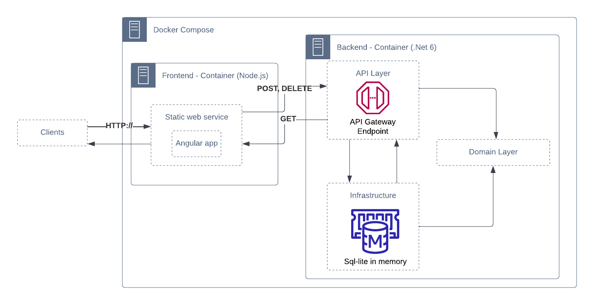
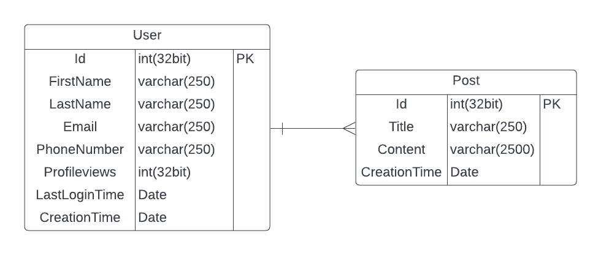

# WebApi (.Net6) and Angular CRUD 

The following project contains: 

## Backend
- A <b>Backend</b> (Server side) .Net 6.0  API endpoints for the CRUD
    - The Backend was developed according to the [<b>D</b>omain <b>D</b>riven <b>D</b>esign](https://learn.microsoft.com/en-us/dotnet/architecture/microservices/microservice-ddd-cqrs-patterns/ddd-oriented-microservice)(DDD) microsoft specification. There are three projects-libraries API / Domain / Infrastructure, inside the UserBackend folder, each one with the corresponding model responsability.
      - The application layer (API):  or the presentation layer contains all the API endpoints and contracts with the client.
      - The Domain layer (Domain): Contains all the bussiness logic and validations, this layer is in charge of aggregating the data and containing the bussiness rules.
      - The Infrastructure layer: In charge of the data persistance, contains the implementation of the EFC ([Entity Framework Core](https://learn.microsoft.com/en-us/dotnet/architecture/microservices/microservice-ddd-cqrs-patterns/infrastructure-persistence-layer-implementation-entity-framework-core)), which supports different data stores like SQL or non-SQL.
    - The API depends on the Domain and the Infrastructure, the Infrastructure on the Domain, the Domain does not depend on any.
    - The data store used for the demo was the microsoft [In-memory database](https://learn.microsoft.com/en-us/dotnet/standard/data/sqlite/in-memory-databases), to not create an additional service for the demo project, it uses the same methods as the normal database mapping, the EFC.
    - The validation of the backend fields was done using the [fluent validation sintax](https://docs.fluentvalidation.net/en/latest/).

## Frontend
- A <b>Frontend</b> (Client side) Angular CRUD sample app
    - The Frontend contains an Angular Material Grid (Grid overview) which at the same time contains child Table components and Dialog components to display the API data.
    - The validations of the Frontend fields were done according to the Angular Form Validator specification.  
    - UI Colors, design was selected from the default angular material design style (css). 

## Other
- A <b>Docker compose</b> file to orchestrate both services with a single command, each service contains a Dockerfile with the configuration to start the service.
- This repository contains 2 branches, one for development and one for releasing

## Architecture Diagram


## Backend - Infrastructure Model


## To start with Docker:
`docker compose up`
* Frontend - URL: http://localhost:4200

## To start without docker:
* Inside the /Frontend/ end folder `ng serve`
* Inside the /Backend/UserBackend/API folder `dotnet run`

## API Endpoints 
<b>Swagger</b>: https://localhost:7066/swagger/index.html 

| Method | Path                 | Description                 | Sample request                                                                                                                                        |
|--------|----------------------|-----------------------------|-------------------------------------------------------------------------------------------------------------------------------------------------------|
| GET    | User/All             | Get the list of all users   |                                                                                                                                                       |
| GET    | User/Posts           | Get the list of all posts   |                                                                                                                                                       |
| GET    | User/Posts/{user_id} | Get the the posts of a user |                                                                                                                                                       |
| POST   | User/Create          | Creates an user             | ``` {  "firstName": "First name",  "lastName": "Second Name",  "email": "email_address@gmail.com",  "phoneNumber": "+5412345678"}```                  |
| POST   | User/Update          | Updates the fields an user  | ``` {  "id" : 1,  "firstName": "Update name",  "lastName": "Update last name",  "email": "email_address@gmail.com",  "phoneNumber": "+5412345678"}``` |
| DELETE | User/Delete          | Deletes an user             | ``` {  "id": 1,  "firstName": "string",  "lastName": "string",  "email": "email_address@gmail.com",  "phoneNumber": "+5412345678"}```                 |

##  What can be improved:
There are several things that could be improved:
* Using a real database service and orchestrate it with docker
* Adding unit tests for all the services 
* Adding a docker testing step for both services 
* Adding routes and more views to the UI
* Adding SSL support
* Cleaner development git code history (on the development branch)
* Adding user Auth
* Adding a HTTP server such as NGINX for the Angular Frontend
* Add the repository to a CD/CI pipeline 

This is development build not recommended for a production environment.
